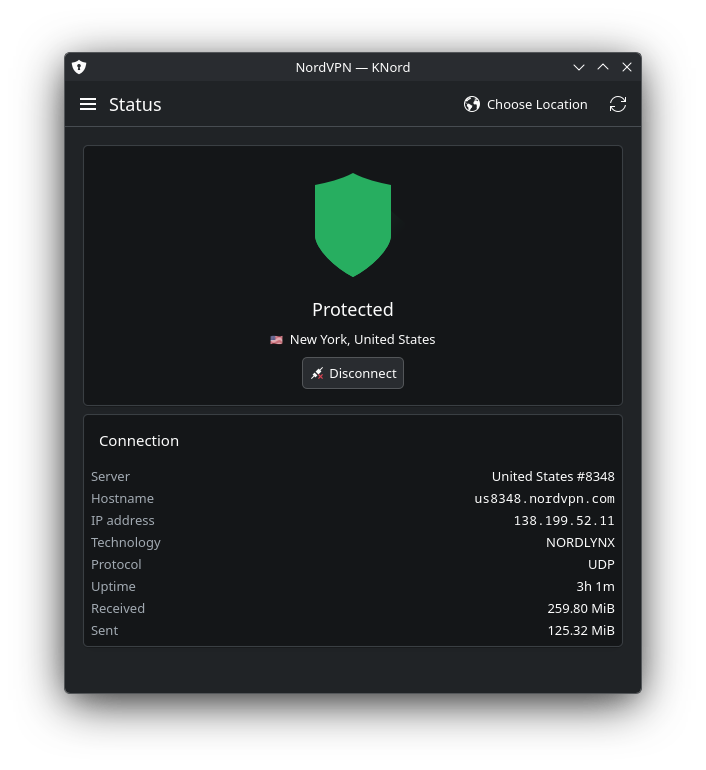
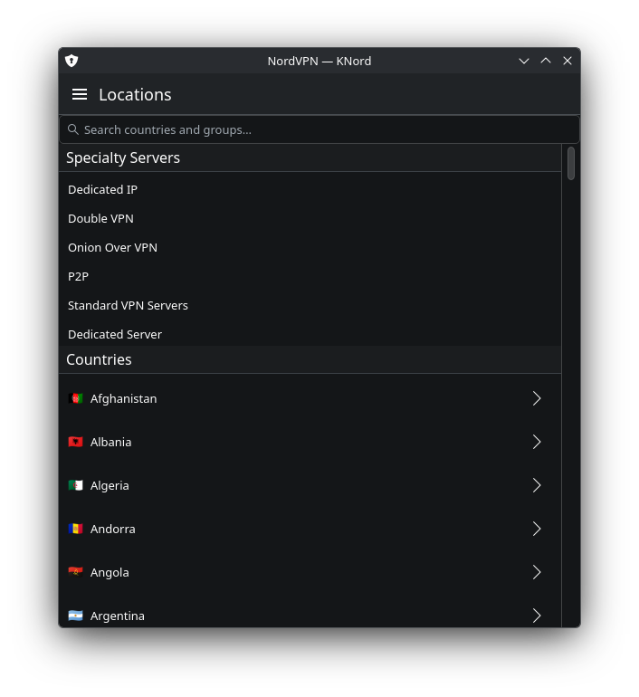
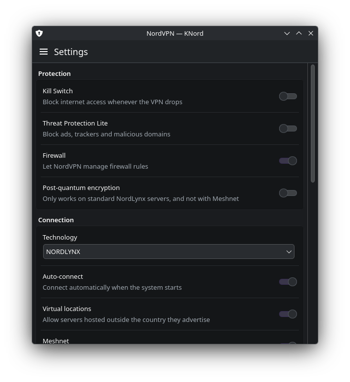

# KNord

[](https://github.com/timpalpant/knord/actions/workflows/ci.yml)
[](https://github.com/timpalpant/knord/releases)
[](LICENSE)

A native Kirigami front end for NordVPN, built for Plasma 6.

It drives the official `nordvpn` command line client, so it needs no extra
privileges and no Electron runtime — it is a normal Qt Quick application that
follows your Breeze theme, color scheme and icon set.

**Website:** <https://timpalpant.github.io/knord/>

> KNord is an unofficial, community-built client. It is not affiliated with,
> endorsed by, or supported by Nord Security. An active NordVPN subscription
> and the official client are required.

## Screenshots

<p align="center">
  
  
  
</p>

## Features

- **Status** — connection state, server, hostname, IP, technology, protocol,
  live uptime and transfer counters.
- **Quick Connect** and one-click disconnect.
- **Locations** — searchable list of all countries with flags, drill-down into
  a country's cities, plus the specialty server groups (Double VPN, Onion Over
  VPN, P2P, Dedicated IP…).
- **Settings** — Kill Switch, Threat Protection Lite, firewall, post-quantum
  encryption, technology and protocol, auto-connect, Meshnet, LAN discovery,
  ARP ignore, notifications, analytics and custom DNS.
- **Allowlist** — add and remove ports, port ranges and subnets.
- **Account** — subscription state, expiry, dedicated IP and MFA status.
- **Sign in** — browser-based Nord Account login, with a paste-the-link
  fallback and token sign-in, plus sign-out.
- **System tray** — optional. When enabled, state at a glance and
  connect/disconnect without opening the window, and closing the window hides
  to the tray. When disabled, closing the window quits KNord entirely; the
  daemon keeps the tunnel up regardless, so nothing needs to stay running.

## Requirements

- Plasma 6 / KF6 6.x (Kirigami, Kirigami Addons, KI18n, KCoreAddons,
  KNotifications, KIconThemes, KStatusNotifierItem, KWindowSystem)
- Qt 6.5 or newer
- The NordVPN client, with your user in the `nordvpn` group

## Installing

### Arch Linux

Each release attaches a prebuilt `*.pkg.tar.zst`, if you would rather not
build locally:

```sh
sudo pacman -U knord-*.pkg.tar.zst
```

### Debian / Ubuntu

Download `knord_*.deb` from the [latest release](https://github.com/timpalpant/knord/releases), then:

```sh
sudo apt install ./knord_*.deb
```

### Fedora / RPM-based distributions

Download `knord-*.rpm` from the [latest release](https://github.com/timpalpant/knord/releases), then:

```sh
sudo dnf install ./knord-*.rpm
```

Install the official NordVPN client first: it supplies the required
`nordvpn` command and system service.

### Flatpak

Download `knord.flatpak` from the
[latest release](https://github.com/timpalpant/knord/releases), then:

```sh
flatpak install --user knord.flatpak
flatpak run io.github.timpalpant.knord
```

The Flatpak still needs the NordVPN client installed **on the host**: it is
proprietary and depends on a systemd system service, so it cannot be bundled.
KNord runs every command through `flatpak-spawn --host`, which is why the
package asks for `--talk-name=org.freedesktop.Flatpak`. That is a broad
permission, effectively host access; if you would rather not grant it, use the
Arch package or build from source instead.

### From source

```sh
cmake -B build -G Ninja -DCMAKE_BUILD_TYPE=Release
cmake --build build
sudo cmake --install build --prefix /usr
```

On Arch, the build dependencies are:

```sh
sudo pacman -S --needed cmake ninja qt6-base qt6-declarative qt6-tools \
    kirigami kirigami-addons ki18n kcoreaddons kconfig knotifications \
    kiconthemes kstatusnotifieritem kwindowsystem qqc2-desktop-style
```

## Building and testing

```sh
cmake -B build -G Ninja -DBUILD_TESTING=ON
cmake --build build
ctest --test-dir build --output-on-failure
```

The test suite covers the CLI output parsers and the country-to-flag mapping —
the parts most likely to break when NordVPN changes its output. It is headless
and needs neither a display nor the NordVPN client.

```sh
cmake --build build --target all_qmllint   # expected to be silent
clang-format -i $(git ls-files '*.cpp' '*.h')
```

`.qmllint.ini` disables only `UnqualifiedAccess`, because the `i18n*` functions
are injected into the QML context at runtime by `KLocalizedContext` and cannot
be resolved statically. Every other check stays on, and CI treats warnings as
failures.

## How it talks to NordVPN

Everything goes through the `nordvpn` CLI. Commands are serialized through a
single queue, because the daemon does not handle concurrent clients well, and
run with `LC_ALL=C.UTF-8` so the output labels the parsers key off stay stable.

Connection status is polled every two seconds while the window is visible and
every ten seconds when it is hidden in the tray. After any change the app
re-reads `nordvpn status` and `nordvpn settings` rather than trusting the
output of the command it just ran.

## Known limitations

- Meshnet is exposed only as an on/off switch — peer management and file
  sharing are not covered.
- Server load and per-server selection are not shown; the CLI does not report
  them.

## License

GPL-3.0-or-later.
